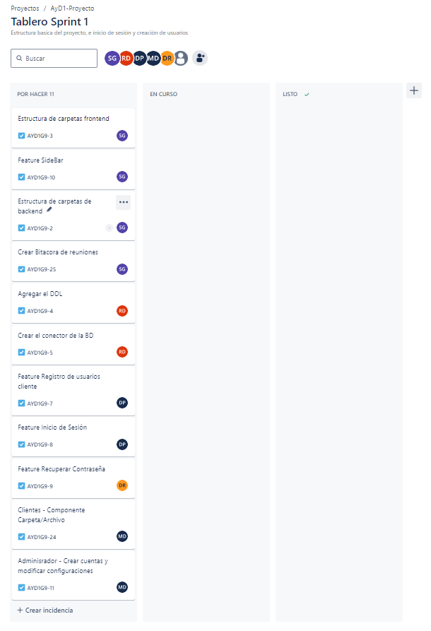

# Bitácora de Reuniones

## Sprint 1 - Documento de Seguimiento

### Daily Scrum 1 - 11/09/2024

| Integrante  | Tarea para hoy                   | Tarea completada ayer | Impedimentos |
|-------------|----------------------------------|-----------------------|--------------|
| Steven      | Estructua de Backend  y Frontend | N/A                   | N/A          |
| Robin       | Agregar DDL                      | N/A                | N/A|
| Douglas     | Recuperar Contraseña  | N/A             | N/A|
| Danny       | Registro de usuarios       | N/A              | N/A|
| Max         | Componente de carpeta/Archivo      | N/A               | N/A|

### Daily Scrum 2 - 12/09/2024

| Integrante  | Tarea para hoy | Tarea completada ayer | Impedimentos |
|-------------|----------------|-----------------------|--------------|
| Steven      | Crear SideBar | Estructua de Backend  y Frontend | N/A |
| Robin       | Agregar DML                      | Agregar DDL | N/A|
| Douglas     | Recuperar Contraseña  | N/A             | N/A|
| Danny       | Inicio Sesión       | Registro de usuarios  | N/A|
| Max         | Crear Cuentas Administrador   |  Componente de carpeta/Archivo | N/A|

### Daily Scrum 3 - 13/09/2024

| Integrante  | Tarea para hoy | Tarea completada ayer | Impedimentos |
|-------------|----------------|-----------------------|--------------|
| Steven      | Crear SideBar | N/A    | N/A |
| Robin       | Crear Conector de la base de datos    | Agregar DML | N/A|
| Douglas     | Recuperar Contraseña  | N/A             | N/A|
| Danny       | Inicio Sesión       | N/A    | N/A|
| Max         | Modificar configuraciones de cuentas   |  Crear Cuentas Administrador| N/A|

### Tabla de Sprint Backlog

| Elemento del Sprint Backlog                               | Estado     | Justificación                                                                    |
|-----------------------------------------------------------|------------|----------------------------------------------------------------------------------|
| Estructura de carpetas frontend                           | Completado | Organizar adecuadamente los archivos para una mejor mantenibilidad del proyecto. |
| Estructura de carpetas backend                            | Completado | Facilitar el desarrollo y la escalabilidad del backend.                          |
| Componente Sidebar                                        | Completado | Implementar un sistema de navegación eficiente en la interfaz.                   |
| Crear DDL                                                 | Completado  | Definir las tablas de la base de datos para el almacenamiento de datos.          |
| Crear conector de la BD en el backend                     | Completado  | Establecer la conexión con la base de datos para las operaciones CRUD.           |
| Feature Registro de usuarios cliente                      | Completado  | Permitir a los usuarios registrarse en la plataforma.                            |
| Feature Inicio de Sesión                                  | Completado  | Habilitar el acceso a la plataforma mediante autenticación.                      |
| Feature Recuperar Contraseña                              | Completado  | Permitir a los usuarios recuperar el acceso en caso de olvidar su contraseña.    |
| Componente Carpeta/Archivo                                | Completado  | Proveer a los usuarios la funcionalidad para gestionar archivos y carpetas.      |
| Administrador - Crear Cuentas y Modificar configuraciones | Completado  | Facilitar la gestión de usuarios y configuraciones por parte del administrador.  |

### Tablero al inicio del sprint

### Tablero al finalizar el sprint

### Sprint Planning

#### Información del Sprint

**Número de Sprint:** 1
**Fecha de inicio:** 10/09/2024
**Fecha de fin:** 13/09/2024
**Objetivo del Sprint:** Tener la estructura del backend, frontend, base de datos, creación de usuarios de los tres tipos y el inicio de sesión de cada uno.

Durante este sprint, nos enfocaremos en realizar estas tareas.

| Item                                                        | Descripción                                                                                  | Estimación | Responsable| Estado       |
|-------------------------------------------------------------|----------------------------------------------------------------------------------------------|------------|------------|--------------|
| 1.Estructura de carpetas frontend                           | Crear la estructura básica de controladores y clases                                         | 0.5 dias | Steven     | Finalizado   |
| 2.Estructura de carpetas backend                            | Crear la estructura basica de componentes, layouts y pages                                   | 0.5 dias | Steven     | Finalizado   |
| 3.Componente Sidebar                                        | Crear el componente SideBar responsivo                                                       | 1 dia | Steven     | Finalizado   |
| 4.Crear DDL                                                 | Crear el script DDl de la bd                                                                 | 1 dia | Robin      | Finalizado       |
| 5.Craer conector de la BD en el backend                     | Crear la función/objeto que permitirá la conexion a la bd en el backend                      | 1 dia | Robin      | Finalizado       |
| 6.Feature Registro de usuarios cliente                      | Implementar el registro de usuarios tanto en frontend como backend                           | 1.5 dias | Danny      | Finalizado       |
| 7.Feature Inicio de Sesión                                  | Implementar el inicio de sesión de usaurios tanto en frontend como backend                   | 1.5 dias | Danny      | Finalizado       |
| 8.Feature Recuperar Contraseña                              | Implementar la recuperación de contraseñas tanto en frontend como backend                    | 3 dias | Douglas    | Finalizado       |
| 9.Componente Carpeta/Archivo                                | Crear el componente que representará una carpeta o archivo dentro del explorador de archivos | 1.5 dias | Max        | Finalizado       |
| 10.Administrador - Crar Cuentas y Modificar configuraciones | Crear el crud de administrador de usuarios y la configuración de sus cuentas                 | 1.5 dias | Max        | Finalizado       |

### Sprint Retrospective

#### [Estudiante 1] Steven Gonzalez - 201903974

- ¿Qué se hizo bien durante el Sprint?
    - Completo todas las tareas asignadas.
- ¿Qué se hizo mal durante el Sprint?
    - Hubo falta de planificacion detallada lo que generó cambios sobre la marcha.
- ¿Qué mejoras se deben implementar para el próximo sprint?
    - mejorar la planificación

#### [Estudiante 2] Danny Tejaxun - 201908355

- ¿Qué se hizo bien durante el Sprint?
    - La implementacion del sistema de login se integró exitosamente con el frontend y backend.
- ¿Qué se hizo mal durante el Sprint?
    - Se tuvo dificultadoes para coordinar horarios.
- ¿Qué mejoras se deben implementar para el próximo sprint?
    - mejorar la coordinación de horarios con  los demas miembros del equipo

#### [Estudiante 3] Robin Buezo- 201944994

- ¿Qué se hizo bien durante el Sprint?
    - La implementacion de la base de datos funciono para todos los miembros del equipo.
- ¿Qué se hizo mal durante el Sprint?
    - Hicieron falta algunos valores en el DML.
- ¿Qué mejoras se deben implementar para el próximo sprint?
    - Validar todos los posibles valores que se deben almacenar en la BD.

#### [Estudiante 4] Douglas Rivera - 2011122881

- ¿Qué se hizo bien durante el Sprint?
    - Terminó sus asignaciones a timepo.
- ¿Qué se hizo mal durante el Sprint?
    - No valido e hizo pruebas de todos los posibles escenarios
- ¿Qué mejoras se deben implementar para el próximo sprint?
    - Realizar mas validaciónes para evitar errores

#### [Estudiante 5] Max Duran - 201902219

- ¿Qué se hizo bien durante el Sprint?
    - Terminó sus asignaciónes a tiempo
- ¿Qué se hizo mal durante el Sprint?
    - No utilizo los colores correctos en sus componentes
- ¿Qué mejoras se deben implementar para el próximo sprint?
    - Seguir el tema de colores en el frontend

