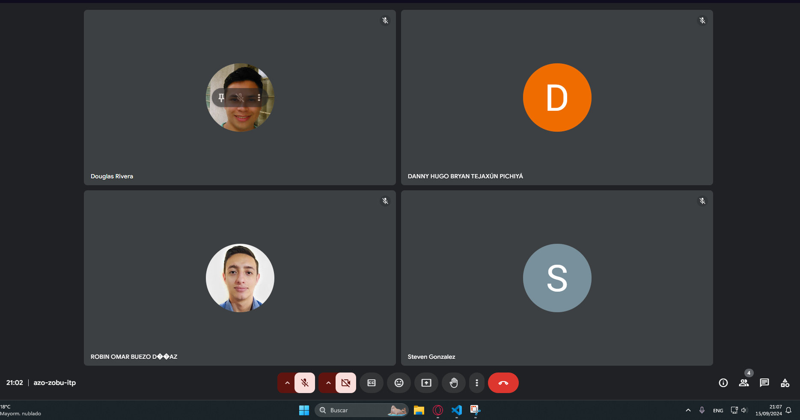
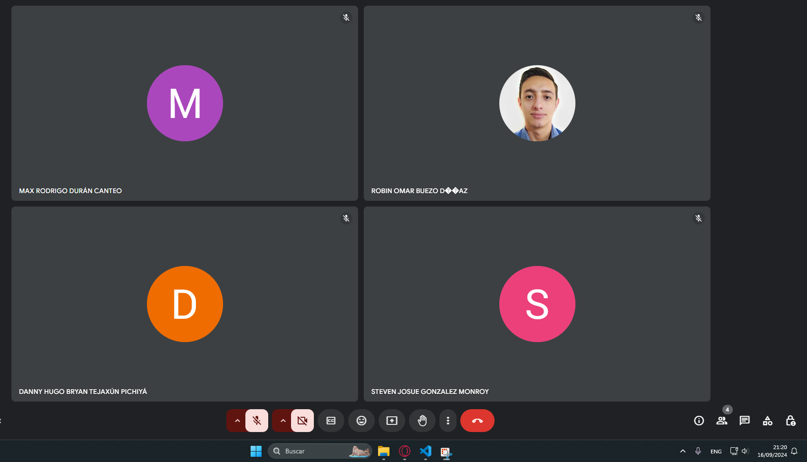
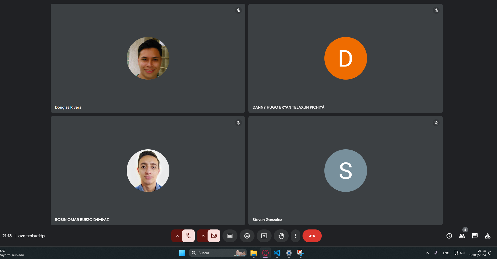
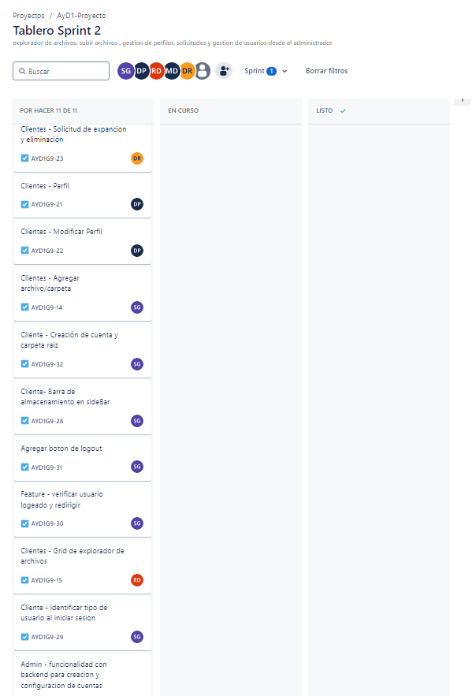
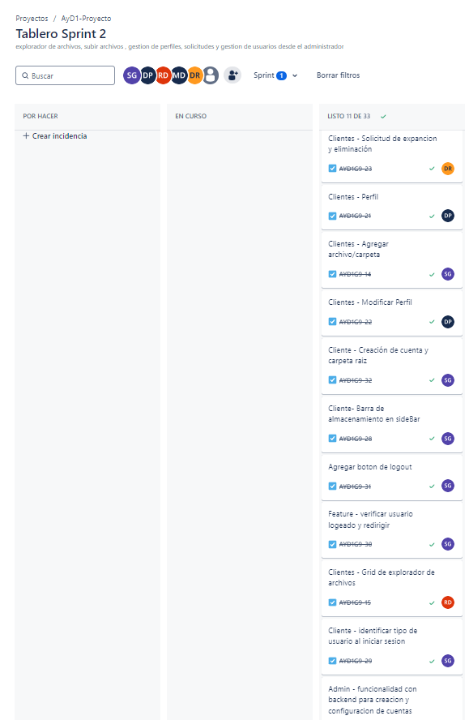

# Bitácora de Reuniones

## Sprint 2 - Documento de Seguimiento

### Daily Scrum 1 - 15/09/2024

| Integrante  | Tarea para hoy | Tarea completada ayer | Impedimentos |
|-------------|----------------|-----------------------|--------------|
| Steven      | Agregar Archivo/Carpeta| N/A    | N/A |
| Robin       | Grid explorador de archivos| N/A | N/A|
| Douglas     | Crear Solicitud de expansion | N/A             | N/A|
| Danny       | Modificar Perfil      | N/A    | N/A|
| Max         | Backend para creacion de cuentas desde Administrador  |  N/A| N/A|

### Daily Scrum 2 - 16/09/2024

| Integrante  | Tarea para hoy | Tarea completada ayer | Impedimentos |
|-------------|----------------|-----------------------|--------------|
| Steven      | Agregar Archivo/Carpeta | N/A| N/A |
| Robin       | Grid explorador de archivos| N/A | N/A|
| Douglas     | Crear Solicitud de expansion | N/A             | N/A|
| Danny       | Modificar Perfil      | N/A    | N/A|
| Max         | Backend para creacion de cuentas desde Administrador  |  N/A| N/A|

### Daily Scrum 3 - 17/09/2024

| Integrante  | Tarea para hoy | Tarea completada ayer | Impedimentos |
|-------------|----------------|-----------------------|--------------|
| Steven      | Barra de almacenamiento en sidebar | Creacion de cuenta y carpeta raiz    | N/A |
| Robin       | Grid explorador de archivos| N/A | N/A|
| Douglas     | Crear Solicitud de expansion | N/A             | N/A|
| Danny       | Modificar Perfil      | N/A    | N/A|
| Max         | Backend para creacion de cuentas desde Administrador  |  N/A| N/A|

### Tabla de Sprint Backlog

| Elemento del Sprint Backlog                          | Estado     | Justificación                                                                                                 |
|------------------------------------------------------|------------|---------------------------------------------------------------------------------------------------------------|
| **Modificar perfil**                                 | Completado | Se implementó con éxito la funcionalidad para que los usuarios puedan actualizar su información personal y preferencias, mejorando la experiencia del usuario y asegurando que puedan mantener su información al día. |
| **Agregar Archivo/Carpeta**                          | Completado | La funcionalidad fue agregada para permitir a los usuarios gestionar sus archivos y carpetas dentro de la plataforma, lo que es fundamental para la estructura y el uso del sistema de almacenamiento. |
| **Creación de Cuenta y carpeta raíz**                | Completado | La creación de cuentas con una carpeta raíz asociada garantiza que cada nuevo usuario tenga su propio espacio de almacenamiento desde el primer momento. Esto es crucial para la organización y seguridad de los datos. |
| **Barra de almacenamiento en sidebar**               | Completado | La barra de almacenamiento fue añadida para que los usuarios tengan una visualización clara del espacio disponible, mejorando la usabilidad y control sobre los recursos de almacenamiento. |
| **Backend para creación de cuentas como Administrador** | Completado | La funcionalidad fue integrada para permitir la creación de cuentas de administradores, lo que es vital para la gestión y control del sistema por parte de usuarios con privilegios elevados. |
| **Grid explorador de archivos**                      | Completado | Se implementó un grid para navegar entre archivos, mejorando la accesibilidad y organización del contenido, lo cual es esencial para que los usuarios puedan encontrar y gestionar sus archivos de forma eficiente. |
| **Perfil**                                           | Completado | Se terminó la funcionalidad del perfil para permitir la visualización y actualización de la información personal del usuario, contribuyendo a la personalización y gestión de datos de cada usuario. |
| **Solicitudes de expansión y eliminación**           | Completado | Se agregaron las funciones de solicitud de expansión y eliminación de archivos, lo que permite a los usuarios gestionar mejor su espacio de almacenamiento y limpiar archivos innecesarios. |

### Tablero al inicio del sprint

### Tablero al finalizar el sprint

### Sprint Planning

#### Información del Sprint

**Número de Sprint:** 2
**Fecha de inicio:** 14/09/2024
**Fecha de fin:** 17/09/024
**Objetivo del Sprint:** Tener las vistas principales de los clientes y administradores

Durante este sprint, nos enfocaremos en realizar estas tareas.

Durante este sprint, nos enfocaremos en realizar estas tareas.

| Item                                              | Descripción                                                                                                                                      | Estimación | Responsable | Estado       |
|---------------------------------------------------|--------------------------------------------------------------------------------------------------------------------------------------------------|------------|-------------|--------------|
| **Creación de cuenta y carpeta raíz**             | Implementar la funcionalidad para que al crear una nueva cuenta de usuario, automáticamente se genere una carpeta raíz en el sistema de archivos.  | 2 días     | Steven      | Completado   |
| **Perfil y modificar Perfil**                     | Desarrollo de la interfaz y backend para que los usuarios puedan visualizar y editar su perfil, incluyendo la actualización de datos personales.    | 3 días     | Danny       | Completado   |
| **Barra de almacenamiento en SideBar**            | Implementación de una barra de progreso en la barra lateral que muestre al usuario el espacio de almacenamiento utilizado y disponible.            | 1 día      | Steven      | Completado   |
| **Grid explorador de archivos**                   | Crear un sistema de visualización en formato de cuadrícula para que los usuarios puedan navegar fácilmente por sus archivos y carpetas.             | 3 días     | Robin       | Completado   |
| **Funcionalidad con backend para creación y configuración de cuentas** | Desarrollar la integración del backend para la creación de nuevas cuentas, permitiendo la asignación de roles y la configuración inicial.            | 3 días     | Max         | Completado   |
| **Solicitud de expansión y eliminación**          | Implementar una funcionalidad que permita a los usuarios solicitar la expansión de su espacio de almacenamiento o la eliminación de sus cuentas.    | 3 días     | Douglas     | Completado   |

### Sprint Retrospective

#### [Estudiante 1] Steven Gonzalez - 201903974

- ¿Qué se hizo bien durante el Sprint?
    - Se resolvieron eficientemente los problemas técnicos que surgieron durante el desarrollo, evitando mayores retrasos.
- ¿Qué se hizo mal durante el Sprint?
    - Se subestimaron algunas tareas, lo que llevó a retrasos en la entrega de ciertos componentes.
- ¿Qué mejoras se deben implementar para el próximo sprint?
    - Hacer una estimación más precisa del esfuerzo necesario para cada tarea, utilizando herramientas de medición más detalladas.

#### [Estudiante 2] Danny Tejaxun - 201908355

- ¿Qué se hizo bien durante el Sprint?
    - Aplico buenas practicas de programación en el frontend , lo que facilita su mantenimiento en el futuro
- ¿Qué se hizo mal durante el Sprint?
    - Debido a los cambios en el codigo se generaron conflictos en los merge lo cual creo algunas confusiones
- ¿Qué mejoras se deben implementar para el próximo sprint?
    - Tratar de no modificar codigo de otros miembros para no generar conflictos en los merge.

#### [Estudiante 3] Robin Buezo- 201944994

- ¿Qué se hizo bien durante el Sprint?
    - La implementacion querys  a la base de datos bastante claras y optimas, lo que mejora los tiempos de respuesta
- ¿Qué se hizo mal durante el Sprint?
    - No se consideraron adecuadamente los escenarios de errores en las transacciones de la base de datos.
- ¿Qué mejoras se deben implementar para el próximo sprint?
    - Implementar un manejo más robusto de excepciones para las operaciones en la base de datos.

#### [Estudiante 4] Douglas Rivera - 2011122881

- ¿Qué se hizo bien durante el Sprint?
    - Se mejoró la reutilización de codigo en el frontend, facilitando su comprensión por otros miembros del equipo.
- ¿Qué se hizo mal durante el Sprint?
    - No se realizaron revisiones de código con suficiente frecuencia, lo que llevó a retrasos en la integración de algunos componentes.
- ¿Qué mejoras se deben implementar para el próximo sprint?
    - Establecer un proceso de revisiones de código más estricto y frecuente para asegurar la calidad y evitar bloqueos.

#### [Estudiante 5] Max Duran - 201902219

- ¿Qué se hizo bien durante el Sprint?
    - Se mejoró la presentación de los componentes creados.
- ¿Qué se hizo mal durante el Sprint?
    - No se realizaron suficientes pruebas de compatibilidad entre navegadores, lo que generó algunos problemas en ciertas plataformas.
- ¿Qué mejoras se deben implementar para el próximo sprint?
    - Asegurar que todas las funcionalidades nuevas se prueben en los principales navegadores y dispositivos para garantizar una experiencia uniforme.

