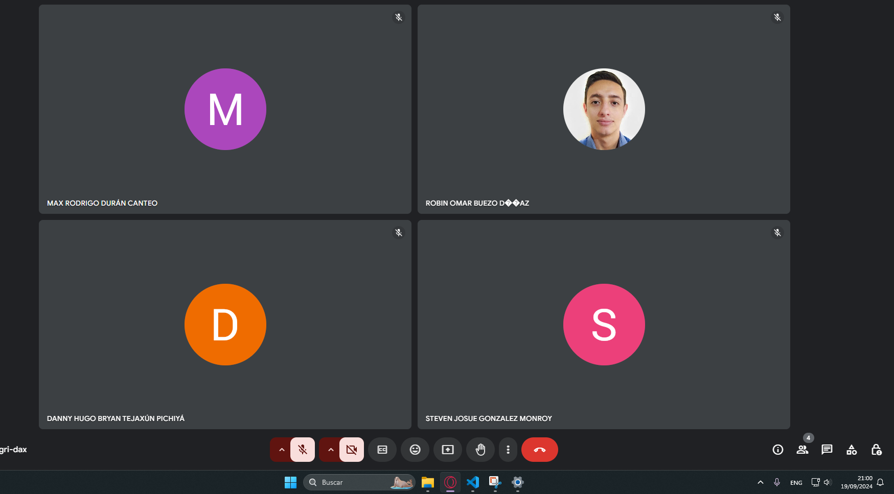

# Bitácora de Reuniones

## Sprint 3 - Documento de Seguimiento

### Daily Scrum 1 - 19/09/2024

| Integrante  | Tarea para hoy | Tarea completada ayer | Impedimentos |
|-------------|----------------|-----------------------|--------------|
| Steven      | Papelera| N/A    | N/A |
| Robin       | Eliminar cuentas despues de 30 dias y restaurar cuentas eliminadas | N/A | N/A|
| Douglas     | visualizacion y aprobacion de solicitudes | N/A             | N/A|
| Danny       | Renombrar Archivos/ Carpetas | N/A    | N/A|
| Max         | Correccion tipos de cuentas al crear usuarios como administrador  |  N/A| N/A|

### Daily Scrum 2 - 20/09/2024

| Integrante  | Tarea para hoy | Tarea completada ayer | Impedimentos |
|-------------|----------------|-----------------------|--------------|
| Steven      | Restaurar Archivos eliminados | Papelera| N/A |
| Robin       | Eliminar cuentas despues de 30 dias y restaurar cuentas eliminadas | N/A | N/A|
| Douglas     | visualizacion y aprobacion de solicitudes | N/A             | N/A|
| Danny       | Descargar Archivos     | Renombrar Archivos/ Carpetas   | N/A|
| Max         | Notificaciones de eliminacion en 30 dias a los usuarios |  Correccion tipos de cuentas al crear usuarios como administrador| N/A|

### Daily Scrum 3 - 21/09/2024

| Integrante  | Tarea para hoy | Tarea completada ayer | Impedimentos |
|-------------|----------------|-----------------------|--------------|
| Steven      | Vaciar Papelera | Restaurar Archivos eliminados  | N/A |
| Robin       | Eliminar cuentas despues de 30 dias y restaurar cuentas eliminadas | N/A | N/A|
| Douglas     | visualizacion y aprobacion de solicitudes | N/A             | N/A|
| Danny       | Descargar Archivos  | N/A    | N/A|
| Max         | Cambio de estado de usuarios a estado de advertencia de eliminación  |  Notificaciones de eliminacion en 30 dias a los usuarios| N/A|

### Tabla de Sprint Backlog

| Elemento del Sprint Backlog                          | Estado     | Justificación                                                                                                 |
|------------------------------------------------------|------------|---------------------------------------------------------------------------------------------------------------|
| **Papelera**                                         | Completado | Se implementó la funcionalidad de papelera para que los usuarios puedan almacenar temporalmente los archivos eliminados, mejorando la seguridad y permitiendo la recuperación de datos. |
| **Restaurar Archivos Eliminados**                    | Completado | Se añadió la opción de restaurar archivos eliminados para dar flexibilidad a los usuarios y permitirles recuperar archivos accidentalmente borrados. |
| **Vaciar Papelera**                                  | Completado | Se implementó la opción de vaciar la papelera para liberar espacio de almacenamiento y facilitar la gestión eficiente del almacenamiento. |
| **Visualizar y aprobar solicitudes de eliminación de cuenta o expansión de espacio** | Completado | Los administradores ahora pueden gestionar las solicitudes de eliminación de cuentas o expansión de espacio, mejorando la supervisión y el control sobre los recursos del sistema. |
| **Renombrar Archivos/Carpetas**                      | Completado | Se desarrolló la funcionalidad de renombrar archivos y carpetas para ofrecer a los usuarios mayor control sobre la organización de sus documentos. |
| **Descargar Archivos/Carpetas**                      | Completado | Se completó la funcionalidad de descarga de archivos y carpetas, permitiendo a los usuarios acceder a su contenido localmente, mejorando la accesibilidad. |
| **Corrección de tipos de cuentas a la hora de crear usuarios como administrador** | Completado | Se corrigió el manejo de los tipos de cuentas para que los administradores asignen correctamente roles y permisos, evitando errores en la creación de usuarios. |
| **Cambiar estado de usuarios al momento de eliminarlos y notificar por correo la eliminación en 30 días** | Completado | Se implementó el cambio de estado para usuarios eliminados y la notificación por correo, brindando un margen de tiempo para restaurar cuentas antes de su eliminación definitiva. |
| **Eliminar cuenta en 30 días y restaurar cuentas eliminadas** | Completado | Se habilitó la opción de eliminar cuentas tras 30 días de inactividad, así como restaurar aquellas cuentas que se eliminaron accidentalmente o bajo solicitud. |
| **Módulo de empleado con funcionalidades parecidas al administrador** | Completado | Se desarrolló un módulo para empleados con funcionalidades similares a las del administrador, brindando capacidades adicionales para gestión de cuentas y archivos. |

### Tablero al inicio del sprint

### Tablero al finalizar el sprint

### Sprint Planning

#### Información del Sprint

**Número de Sprint:** 3
**Fecha de inicio:** 18/09/2024
**Fecha de fin:** 21/09/024
**Objetivo del Sprint:** Dar funcionalidad al explorador de archivos, aprobar o rechazar solicitudes en el modulo admionistrador, implementar el modulo empleado, realizar correcciones.

Durante este sprint, nos enfocaremos en realizar estas tareas.

| Item                                                        | Descripción                                                                                                                                              | Estimación | Responsable | Estado       |
|-------------------------------------------------------------|----------------------------------------------------------------------------------------------------------------------------------------------------------|------------|-------------|--------------|
| **Papelera**                                                 | Implementar la funcionalidad de papelera para almacenar temporalmente los archivos eliminados, permitiendo que puedan ser restaurados o eliminados de forma definitiva. | 1 día      | Steven      | Completado   |
| **Eliminar Archivo/Carpeta**                                 | Crear la opción para que los usuarios puedan eliminar archivos o carpetas y enviarlos a la papelera, mejorando la organización y limpieza de sus archivos. | 0.5 día    | Steven      | Completado   |
| **Restaurar Archivo/Carpeta**                                | Desarrollar la funcionalidad que permita restaurar archivos o carpetas eliminadas desde la papelera, asegurando que no se pierdan datos accidentalmente.   | 0.5 día    | Steven      | Completado   |
| **Descargar Archivos**                                       | Implementar la opción para descargar archivos del sistema de almacenamiento, permitiendo que los usuarios accedan a su contenido de forma local.          | 2 días     | Danny       | Completado   |
| **Renombrar Archivos/Carpetas**                              | Crear la funcionalidad que permita a los usuarios renombrar archivos y carpetas, dándoles mayor control sobre la organización de sus documentos.           | 1 día      | Danny       | Completado   |
| **Visualizar y aprobar solicitudes de expansión de almacenamiento** | Desarrollar una interfaz y funcionalidad para que los administradores puedan visualizar y aprobar solicitudes de expansión de almacenamiento enviadas por los usuarios. | 3 días     | Douglas     | Completado   |
| **Corrección de tipos de cuentas a la hora de crear usuarios como administrador** | Corregir los errores en la asignación de tipos de cuentas cuando un administrador crea usuarios, asegurando que los permisos sean correctamente asignados.  | 0.5 día    | Max         | Completado   |
| **Cambiar estado de cuentas a advertencia de eliminación al eliminar como administrador** | Implementar el cambio de estado a advertencia de eliminación para cuentas que sean eliminadas por un administrador, permitiendo que los usuarios tengan 30 días para restaurarlas. | 0.5 día    | Max         | Completado   |
| **Notificar eliminación de cuenta en 30 días al eliminar como administrador** | Desarrollar la funcionalidad para que se notifique a los usuarios por correo electrónico cuando una cuenta sea eliminada, informando sobre el período de 30 días para restaurarla. | 1 día      | Max         | Completado   |
| **Vaciar Papelera**                                          | Implementar la opción de vaciar la papelera para que los usuarios puedan eliminar definitivamente todos los archivos contenidos en la misma.                | 1 día      | Steven      | Completado   |
| **Eliminar cuentas después de 30 días y restaurar cuentas eliminadas** | Desarrollar la lógica para eliminar cuentas definitivamente después de 30 días o restaurar cuentas eliminadas a solicitud de los usuarios.                  | 3 días     | Robin       | Completado   |
| **Crear módulos para usuarios Empleados con funciones similares al administrador** | Crear módulos con funcionalidades similares a las del administrador para los usuarios con roles de empleados, permitiendo una gestión más autónoma de sus recursos. | 1 día      | Max         | Completado   |

### Sprint Retrospective

#### [Estudiante 1] Steven Gonzalez - 201903974

- ¿Qué se hizo bien durante el Sprint?
    - La comunicación dentro del equipo fue fluida, lo que permitió resolver dudas rápidamente y avanzar sin demoras.
- ¿Qué se hizo mal durante el Sprint?
    - La falta de documentación adecuada llevó a confusiones sobre las expectativas de ciertas tareas.
- ¿Qué mejoras se deben implementar para el próximo sprint?
    - Establecer un formato estándar para la documentación de tareas y decisiones tomadas durante el desarrollo.

#### [Estudiante 2] Danny Tejaxun - 201908355

- ¿Qué se hizo bien durante el Sprint?
    - Se logró integrar nuevas librerías para envio de correos que optimizaron el rendimiento del backend.
- ¿Qué se hizo mal durante el Sprint?
    - Hubo una confusión con las asignaciones de el con otros miembros.
- ¿Qué mejoras se deben implementar para el próximo sprint?
    - Revisar el tablero Jira para saber que tareas corresponden a cada miembro

#### [Estudiante 3] Robin Buezo- 201944994

- ¿Qué se hizo bien durante el Sprint?
    - Implementó las funcionalidades asignadas rapidamente, lo que permitió hacer pruebas antes de lo esperado.
- ¿Qué se hizo mal durante el Sprint?
    - No se consideraron adecuadamente los escenarios de errores en las transacciones de la base de datos.
- ¿Qué mejoras se deben implementar para el próximo sprint?
    - Implementar un manejo más robusto de excepciones para las operaciones en la base de datos.

#### [Estudiante 4] Douglas Rivera - 2011122881

- ¿Qué se hizo bien durante el Sprint?
    - Se implementaron componentes reutilizables que optimizan el tiempo de desarrollo en futuros sprints.
- ¿Qué se hizo mal durante el Sprint?
    - La falta de pruebas unitarias en algunos componentes llevó a la detección tardía de errores.
- ¿Qué mejoras se deben implementar para el próximo sprint?
    - siempre revisar que variables de entorno ya existen para no crear otras de manera innecesaria

#### [Estudiante 5] Max Duran - 201902219

- ¿Qué se hizo bien durante el Sprint?
    - Se lograron establecer buenas prácticas en el diseño de la interfaz, mejorando la experiencia del usuario.
- ¿Qué se hizo mal durante el Sprint?
    - No se conectó puntal a las reuniónes.
- ¿Qué mejoras se deben implementar para el próximo sprint?
    - Evitar jugar rankeds de valorant en horarios de daily.

