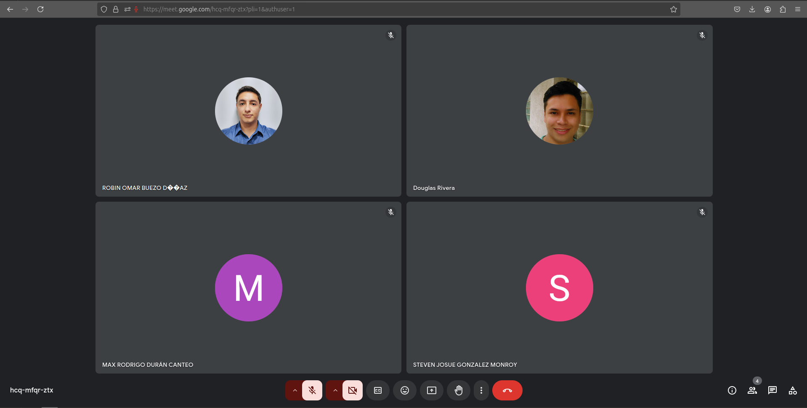

# Bitácora de Reuniones

## Sprint 4 - Documento de Seguimiento

### Tabla de Sprint Backlog

| Elemento del Sprint Backlog                          | Estado     | Justificación                                                                                                 |
|------------------------------------------------------|------------|---------------------------------------------------------------------------------------------------------------|
| **Favoritos**                                        | Completado | Se implementó la funcionalidad de favoritos para que los usuarios puedan destacar archivos y carpetas importantes, facilitando su acceso rápido y organización. |
| **Compartir Carpetas y Archivos**                    | Completado | Se desarrolló la opción para que los usuarios compartan carpetas y archivos con otros usuarios, y se les dio la capacidad de revocar el acceso cuando lo deseen, mejorando la colaboración. |
| **Tags Personalizados**                              | Pendiente | Se añadió la funcionalidad de etiquetas personalizadas para que los usuarios organicen y busquen sus archivos y carpetas de manera más eficiente. |
| **Detalles de Carpetas y Archivos**                  | Completado | Se creó una vista de detalles que muestra información relevante de archivos y carpetas, mejorando la transparencia sobre el contenido almacenado. |
| **Visualizador de Archivos**                         | Completado | Se desarrolló un visor para diferentes tipos de archivos (imágenes, PDF, audio, video), ofreciendo a los usuarios una experiencia más interactiva y accesible. |
| **Recientes**                                        | Pendiente | Se añadió un apartado de archivos y carpetas recientes, facilitando el acceso rápido a los elementos más utilizados o modificados recientemente. |
| **Backup Encriptado**                                | Pendiente | Se implementó la funcionalidad de backup encriptado para archivos y carpetas, garantizando la seguridad y confidencialidad de los datos almacenados. |

### Sprint Planning

#### Información del Sprint

**Número de Sprint:** 4
**Fecha de inicio:** 20/10/2024
**Fecha de fin:** 23/10/024
**Objetivo del Sprint:** Compartir Carpetas, visualizar archivos, ver detalles de archivos y en general terminar las funcionalidades.

Durante este sprint, nos enfocaremos en realizar estas tareas.

| Item                                                    | Descripción                                                                                                                                                  | Estimación | Responsable | Estado     |
|---------------------------------------------------------|--------------------------------------------------------------------------------------------------------------------------------------------------------------|------------|-------------|------------|
| **Favoritos**                                           | Implementar la funcionalidad de favoritos para que los usuarios puedan destacar archivos y carpetas importantes, facilitando su acceso rápido.               | 3 días      | Robin       | Completado |
| **Compartir Carpetas y Archivos**                       | Desarrollar la opción para que los usuarios puedan compartir carpetas y archivos con otros usuarios, con la capacidad de revocar el acceso cuando lo deseen. | 3 días     | Steven      | Completado |
| **Tags Personalizados**                                 | Crear la funcionalidad que permita a los usuarios agregar etiquetas personalizadas a sus archivos y carpetas para mejorar la organización y búsqueda.        | 1 día      | Danny      | Pendiente |
| **Detalles de Carpetas y Archivos**                     | Implementar una vista de detalles que muestre información relevante sobre archivos y carpetas, como tamaño, fecha de modificación, y tipo.                   | 0.5 día    | Danny      | Completado |
| **Visualizador de Archivos**                            | Desarrollar un visor para diferentes tipos de archivos, incluyendo imágenes, PDFs, audio (MP3), y video, para una mejor experiencia del usuario.             | 3 días     | Max       | Completado |
| **Recientes**                                           | Crear un apartado que muestre archivos y carpetas recientemente abiertos o modificados, facilitando el acceso rápido a estos elementos.                      | 1 día      | Danny      | Pendiente |
| **Backup Encriptado**                                   | Implementar una funcionalidad de backup encriptado para archivos y carpetas, garantizando la seguridad y confidencialidad de los datos almacenados.          | 3 días     | Douglas     | Pendiente |

### Tablero al inicio del sprint

### Daily Scrum 1 - 21/10/2024

| Integrante  | Tarea para hoy | Tarea completada ayer | Impedimentos |
|-------------|----------------|-----------------------|--------------|
| Steven      | Modificar el DDL para manejar los archivos/carpetas compartidas| N/A    | N/A |
| Robin       | Modificar el DDL para manejar los archivos/carpetas favoritas | N/A | N/A|
| Douglas     | Crear el apartado en el perfil del ususario para configurar contraseña de backup| N/A             | N/A|
| Danny       | Visualizar los detalles de archivos y carpetas | N/A    | N/A|
| Max         | Crear visualizador de archivos  |  N/A| N/A|

### Daily Scrum 2 - 22/09/2024

| Integrante  | Tarea para hoy | Tarea completada ayer | Impedimentos |
|-------------|----------------|-----------------------|--------------|
| Steven      | Implementar la funcionalidad para compartir e identificar archivos compartidos |Modificar el DDL para manejar los archivos/carpetas compartidas| Entregas de otros proyectos impidieron que avanzara|
| Robin       | Implementar la funcionalidad para ver archivos agregados a favoritos | Modificar el DDL para manejar los archivos/carpetas favoritas | N/A|
| Douglas     | Crear el apartado en el perfil del ususario para configurar contraseña de backup  | Crear el apartado en el perfil del ususario para configurar contraseña de backup          | Entregas de otros proyectos impidieron que avanzara |
| Danny       | Visualizar los detalles de archivos y carpetas    | Visualizar los detalles de archivos y carpetas   | N/A|
| Max         | Crear visualizador de archivos | N/A | Mala configuración de bucket impedia ver algunos archivos |

### Daily Scrum 3 - 23/09/2024

| Integrante  | Tarea para hoy | Tarea completada ayer | Impedimentos |
|-------------|----------------|-----------------------|--------------|
| Steven      | Fincionalidad para dejar de compartir archivos | Implementar la funcionalidad para compartir e identificar archivos compartidos| N/A |
| Robin       | Implementar funcionalidad para eliminar archivos de favoritos | Implementar la funcionalidad para ver archivos agregados a favoritos| N/A|
| Douglas     | Crear el apartado en el perfil del ususario para configurar contraseña de backup | N/A             | Entregas en otros proyectos impidieron avanzar en este  |
| Danny       | Agregar tags personalizadas  | Visualizar los detalles de archivos y carpetas  | Entregas en otros proyectos impidieron avanzar en este |
| Max         |  Crear visualizador de archivos |  N/A | N/A|

### Tablero al finalizar el sprint

### Sprint Review

Durante la review se hizo una demostración de el desarrollo que se completó:

### Sprint Retrospective

**[Estudiante 1] Steven Gonzalez - 201903974**  
- **¿Qué se hizo bien durante el Sprint?**  
  La colaboración con el equipo fue efectiva, lo que facilitó la solución de problemas en el desarrollo de la funcionalidad de favoritos.

- **¿Qué se hizo mal durante el Sprint?**  
  Hubo cierta ambigüedad en los criterios de aceptación para algunas tareas, lo que generó dudas durante el desarrollo.
  A medio sprint priorizó otros proyectos dejando este en pausa.

- **¿Qué mejoras se deben implementar para el próximo sprint?**  
  Definir con mayor claridad los criterios de aceptación de cada tarea al inicio del sprint para evitar confusiones.
  Enfocarse mas en el proyecto actual ya que es un pilar importante de Scrum

---

**[Estudiante 2] Danny Tejaxun - 201908355**  
- **¿Qué se hizo bien durante el Sprint?**  
  La integración de la funcionalidad de detalles de archivos fue rápida y permitió realizar pruebas de manera mas efectiva

- **¿Qué se hizo mal durante el Sprint?**  
  Faltó una comunicación clara sobre las dependencias de algunas tareas, lo que generó retrasos en ciertos momentos.

- **¿Qué mejoras se deben implementar para el próximo sprint?**  
  Revisar las dependencias entre tareas y asegurarse de que todos estén al tanto de ellas para evitar bloqueos.

---

**[Estudiante 3] Robin Buezo - 201944994**  
- **¿Qué se hizo bien durante el Sprint?**  
  Se logró implementar la funcionalidad de Archivos Favoritos de manera efectiva, mejorando la experiencia del usuario.

- **¿Qué se hizo mal durante el Sprint?**  
  Algunos escenarios de errores no se consideraron en las pruebas iniciales, lo que causó retrasos en la corrección.

- **¿Qué mejoras se deben implementar para el próximo sprint?**  
  Aumentar la cobertura de pruebas para incluir más casos de error, especialmente en la visualización de archivos.

---

**[Estudiante 4] Max Duran - 201902219**  
- **¿Qué se hizo bien durante el Sprint?**  
  La creación de componentes reutilizables ayudó a acelerar el desarrollo y mejorará la eficiencia en futuros sprints.

- **¿Qué se hizo mal durante el Sprint?**  
  La interfaz del visualiador es muy pequeña, es dificil leer ciertos pdfs.

- **¿Qué mejoras se deben implementar para el próximo sprint**  
  Mejorar el diseño de los componentes para mejorar la experiencia de usuario

---

**[Estudiante 5] Douglas Rivera - 2011122881**  
- **¿Qué se hizo bien durante el Sprint?**  
  La interfaz de usuario mejoró significativamente en este sprint gracias a las prácticas de diseño implementadas.

- **¿Qué se hizo mal durante el Sprint?**  
  No se logró concluir con el desarrollo debido a otros proyectos

- **¿Qué mejoras se deben implementar para el próximo sprint?**  
 Tratar de priorizar este proyecto ya que es pilar inportante de Scrum

