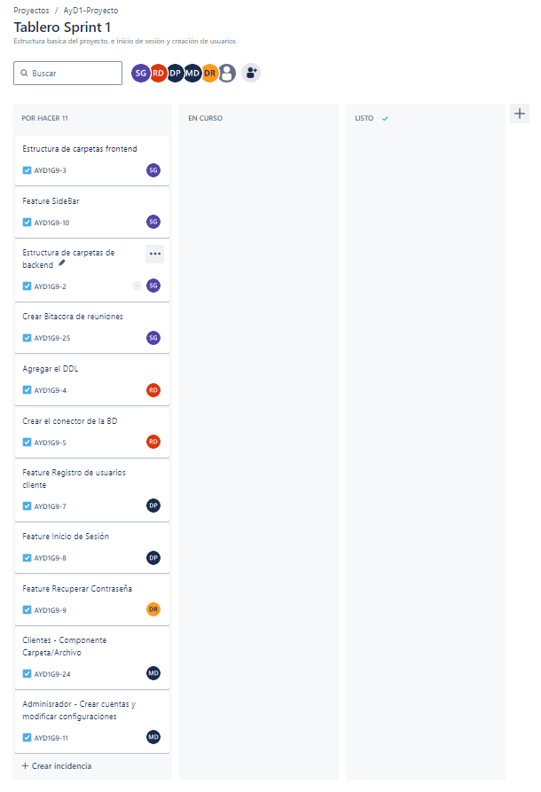

# Bitácora de Reuniones

## Sprint 1 - Documento de Seguimiento

### Daily Scrum 1 - 11/09/2024

| Integrante  | Tarea para hoy                   | Tarea completada ayer | Impedimentos |
|-------------|----------------------------------|-----------------------|--------------|
| Steven      | Estructua de Backend  y Frontend | N/A                   | N/A          |
| Robin       | Tarea actual        | Tarea completada                | Impedimentos|
| Douglas     | Tarea actual        | Tarea completada                | Impedimentos|
| Danny       | Tarea actual        | Tarea completada                | Impedimentos|
| Max         | Tarea actual        | Tarea completada                | Impedimentos|

### Daily Scrum 2 - [Fecha]

| Integrante  | Tarea para hoy | Tarea completada ayer | Impedimentos |
|-------------|----------------|-----------------------|--------------|
| Nombre    | Tarea actual        | Tarea completada                | Impedimentos|
| Nombre    | Tarea actual        | Tarea completada                | Impedimentos|
| Nombre    | Tarea actual        | Tarea completada                | Impedimentos|
| Nombre    | Tarea actual        | Tarea completada                | Impedimentos|
| Nombre    | Tarea actual        | Tarea completada                | Impedimentos|
| Nombre    | Tarea actual        | Tarea completada                | Impedimentos|

### Daily Scrum 3 - [Fecha]

| Integrante  | Tarea para hoy | Tarea completada ayer | Impedimentos |
|-------------|----------------|-----------------------|--------------|
| Nombre    | Tarea actual        | Tarea completada                | Impedimentos|
| Nombre    | Tarea actual        | Tarea completada                | Impedimentos|
| Nombre    | Tarea actual        | Tarea completada                | Impedimentos|
| Nombre    | Tarea actual        | Tarea completada                | Impedimentos|
| Nombre    | Tarea actual        | Tarea completada                | Impedimentos|
| Nombre    | Tarea actual        | Tarea completada                | Impedimentos|

### Tabla de Sprint Backlog

| Elemento del Sprint Backlog                               | Estado     | Justificación                                                                    |
|-----------------------------------------------------------|------------|----------------------------------------------------------------------------------|
| Estructura de carpetas frontend                           | Completado | Organizar adecuadamente los archivos para una mejor mantenibilidad del proyecto. |
| Estructura de carpetas backend                            | Completado | Facilitar el desarrollo y la escalabilidad del backend.                          |
| Componente Sidebar                                        | Completado | Implementar un sistema de navegación eficiente en la interfaz.                   |
| Crear DDL                                                 | Pendiente  | Definir las tablas de la base de datos para el almacenamiento de datos.          |
| Crear conector de la BD en el backend                     | Pendiente  | Establecer la conexión con la base de datos para las operaciones CRUD.           |
| Feature Registro de usuarios cliente                      | Pendiente  | Permitir a los usuarios registrarse en la plataforma.                            |
| Feature Inicio de Sesión                                  | Pendiente  | Habilitar el acceso a la plataforma mediante autenticación.                      |
| Feature Recuperar Contraseña                              | Pendiente  | Permitir a los usuarios recuperar el acceso en caso de olvidar su contraseña.    |
| Componente Carpeta/Archivo                                | Pendiente  | Proveer a los usuarios la funcionalidad para gestionar archivos y carpetas.      |
| Administrador - Crear Cuentas y Modificar configuraciones | Pendiente  | Facilitar la gestión de usuarios y configuraciones por parte del administrador.  |

### Tablero al inicio del sprint

### Tablero al finalizar el sprint

### Sprint Planning

#### Información del Sprint

**Número de Sprint:** 1
**Fecha de inicio:** 10/09/2024
**Fecha de fin:** 13/09/2024
**Objetivo del Sprint:** Tener la estructura del backend, frontend, base de datos, creación de usuarios de los tres tipos y el inicio de sesión de cada uno.

Durante este sprint, nos enfocaremos en realizar estas tareas.

| Item                                                        | Descripción                                                                                  | Estimación | Responsable| Estado       |
|-------------------------------------------------------------|----------------------------------------------------------------------------------------------|------------|------------|--------------|
| 1.Estructura de carpetas frontend                           | Crear la estructura básica de controladores y clases                                         | Estimación | Steven     | Finalizado   |
| 2.Estructura de carpetas backend                            | Crear la estructura basica de componentes, layouts y pages                                   | Estimación | Steven     | Finalizado   |
| 3.Componente Sidebar                                        | Crear el componente SideBar responsivo                                                       | Estimación | Steven     | Finalizado   |
| 4.Crear DDL                                                 | Crear el script DDl de la bd                                                                 | Estimación | Robin      | Estado       |
| 5.Craer conector de la BD en el backend                     | Crear la función/objeto que permitirá la conexion a la bd en el backend                      | Estimación | Robin      | Estado       |
| 6.Feature Registro de usuarios cliente                      | Implementar el registro de usuarios tanto en frontend como backend                           | Estimación | Danny      | Estado       |
| 7.Feature Inicio de Sesión                                  | Implementar el inicio de sesión de usaurios tanto en frontend como backend                   | Estimación | Danny      | Estado       |
| 8.Feature Recuperar Contraseña                              | Implementar la recuperación de contraseñas tanto en frontend como backend                    | Estimación | Douglas    | Estado       |
| 9.Componente Carpeta/Archivo                                | Crear el componente que representará una carpeta o archivo dentro del explorador de archivos | Estimación | Max        | Estado       |
| 10.Administrador - Crar Cuentas y Modificar configuraciones | Crear el crud de administrador de usuarios y la configuración de sus cuentas                 | Estimación | Max        | Estado       |

### Matriz de trazabilidad

| Tareas                   | Requisitos                  | Casos de Uso               | Pruebas E2E                | Documentación             |
|--------------------------|-----------------------------|----------------------------|----------------------------|---------------------------|
| Tarea 1                  | [Requisito]                  | [Caso de Uso]              | [Pruebas E2E]              | [Documentación]           |
| Tarea 2                  | [Requisito]                  | [Caso de Uso]              | [Pruebas E2E]              | [Documentación]           |
| Tarea 3                  | [Requisito]                  | [Caso de Uso]              | [Pruebas E2E]              | [Documentación]           |
| Tarea 4                  | [Requisito]                  | [Caso de Uso]              | [Pruebas E2E]              | [Documentación]           |
| Tarea 5                  | [Requisito]                  | [Caso de Uso]              | [Pruebas E2E]              | [Documentación]           |
| Tarea 6                  | [Requisito]                  | [Caso de Uso]              | [Pruebas E2E]              | [Documentación]           |

### Sprint Retrospective

#### [Estudiante 1] Nombre - [ID]

- ¿Qué se hizo bien durante el Sprint?
    - **Comentario positivo**
- ¿Qué se hizo mal durante el Sprint?
    - **Comentario negativo**
- ¿Qué mejoras se deben implementar para el próximo sprint?
    - **Mejoras sugeridas**

#### [Estudiante 2] Nombre - [ID]

- ¿Qué se hizo bien durante el Sprint?
    - **Comentario positivo**
- ¿Qué se hizo mal durante el Sprint?
    - **Comentario negativo**
- ¿Qué mejoras se deben implementar para el próximo sprint?
    - **Mejoras sugeridas**

#### [Estudiante 3] Nombre - [ID]

- ¿Qué se hizo bien durante el Sprint?
    - **Comentario positivo**
- ¿Qué se hizo mal durante el Sprint?
    - **Comentario negativo**
- ¿Qué mejoras se deben implementar para el próximo sprint?
    - **Mejoras sugeridas**

#### [Estudiante 4] Nombre - [ID]

- ¿Qué se hizo bien durante el Sprint?
    - **Comentario positivo**
- ¿Qué se hizo mal durante el Sprint?
    - **Comentario negativo**
- ¿Qué mejoras se deben implementar para el próximo sprint?
    - **Mejoras sugeridas**

#### [Estudiante 5] Nombre - [ID]

- ¿Qué se hizo bien durante el Sprint?
    - **Comentario positivo**
- ¿Qué se hizo mal durante el Sprint?
    - **Comentario negativo**
- ¿Qué mejoras se deben implementar para el próximo sprint?
    - **Mejoras sugeridas**

---

## Sprint 2 - Documento de Seguimiento

### Daily Scrum 1 - [Fecha]

| Integrante  | Tarea para hoy | Tarea completada ayer | Impedimentos |
|-------------|----------------|-----------------------|--------------|
| Nombre    | Tarea actual        | Tarea completada                | Impedimentos|
| Nombre    | Tarea actual        | Tarea completada                | Impedimentos|
| Nombre    | Tarea actual        | Tarea completada                | Impedimentos|
| Nombre    | Tarea actual        | Tarea completada                | Impedimentos|
| Nombre    | Tarea actual        | Tarea completada                | Impedimentos|
| Nombre    | Tarea actual        | Tarea completada                | Impedimentos|

### Daily Scrum 2 - [Fecha]

| Integrante  | Tarea para hoy | Tarea completada ayer | Impedimentos |
|-------------|----------------|-----------------------|--------------|
| Nombre    | Tarea actual        | Tarea completada                | Impedimentos|
| Nombre    | Tarea actual        | Tarea completada                | Impedimentos|
| Nombre    | Tarea actual        | Tarea completada                | Impedimentos|
| Nombre    | Tarea actual        | Tarea completada                | Impedimentos|
| Nombre    | Tarea actual        | Tarea completada                | Impedimentos|
| Nombre    | Tarea actual        | Tarea completada                | Impedimentos|

### Daily Scrum 3 - [Fecha]

| Integrante  | Tarea para hoy | Tarea completada ayer | Impedimentos |
|-------------|----------------|-----------------------|--------------|
| Nombre    | Tarea actual        | Tarea completada                | Impedimentos|
| Nombre    | Tarea actual        | Tarea completada                | Impedimentos|
| Nombre    | Tarea actual        | Tarea completada                | Impedimentos|
| Nombre    | Tarea actual        | Tarea completada                | Impedimentos|
| Nombre    | Tarea actual        | Tarea completada                | Impedimentos|
| Nombre    | Tarea actual        | Tarea completada                | Impedimentos|

### Daily Scrum 4 - [Fecha]

| Integrante  | Tarea para hoy | Tarea completada ayer | Impedimentos |
|-------------|----------------|-----------------------|--------------|
| Nombre    | Tarea actual        | Tarea completada                | Impedimentos|
| Nombre    | Tarea actual        | Tarea completada                | Impedimentos|
| Nombre    | Tarea actual        | Tarea completada                | Impedimentos|
| Nombre    | Tarea actual        | Tarea completada                | Impedimentos|
| Nombre    | Tarea actual        | Tarea completada                | Impedimentos|
| Nombre    | Tarea actual        | Tarea completada                | Impedimentos|

### Daily Scrum 5 - [Fecha]

| Integrante  | Tarea para hoy | Tarea completada ayer | Impedimentos |
|-------------|----------------|-----------------------|--------------|
| Nombre    | Tarea actual        | Tarea completada                | Impedimentos|
| Nombre    | Tarea actual        | Tarea completada                | Impedimentos|
| Nombre    | Tarea actual        | Tarea completada                | Impedimentos|
| Nombre    | Tarea actual        | Tarea completada                | Impedimentos|
| Nombre    | Tarea actual        | Tarea completada                | Impedimentos|
| Nombre    | Tarea actual        | Tarea completada                | Impedimentos|

### Tabla de Sprint Backlog

| Elemento del Sprint Backlog | Estado | Justificación |
|------------------------------|--------|---------------|
| Elemento 1                   | Estado | Justificación  |
| Elemento 2                   | Estado | Justificación  |
| Elemento 3                   | Estado | Justificación  |
| Elemento 4                   | Estado | Justificación  |
| Elemento 5                   | Estado | Justificación  |
| Elemento 6                   | Estado | Justificación  |

### Tablero al inicio del sprint

### Tablero al finalizar el sprint

### Sprint Planning

#### Información del Sprint

**Número de Sprint:** [Número]
**Fecha de inicio:** [Fecha]
**Fecha de fin:** [Fecha]
**Objetivo del Sprint:** [Objetivo]

Durante este sprint, nos enfocaremos en realizar estas tareas.

| Item                          | Descripción | Estimación | Responsable | Estado       |
|-------------------------------|-------------|------------|-------------|--------------|
| Item 1                        | Descripción  | Estimación | Responsable | Estado       |
| Item 2                        | Descripción  | Estimación | Responsable | Estado       |
| Item 3                        | Descripción  | Estimación | Responsable | Estado       |
| Item 4                        | Descripción  | Estimación | Responsable | Estado       |
| Item 5                        | Descripción  | Estimación | Responsable | Estado       |
| Item 6                        | Descripción  | Estimación | Responsable | Estado       |

### Matriz de trazabilidad

| Tareas                   | Requisitos                  | Casos de Uso               | Pruebas E2E                | Documentación             |
|--------------------------|-----------------------------|----------------------------|----------------------------|---------------------------|
| Tarea 1                  | [Requisito]                  | [Caso de Uso]              | [Pruebas E2E]              | [Documentación]           |
| Tarea 2                  | [Requisito]                  | [Caso de Uso]              | [Pruebas E2E]              | [Documentación]           |
| Tarea 3                  | [Requisito]                  | [Caso de Uso]              | [Pruebas E2E]              | [Documentación]           |
| Tarea 4                  | [Requisito]                  | [Caso de Uso]              | [Pruebas E2E]              | [Documentación]           |
| Tarea 5                  | [Requisito]                  | [Caso de Uso]              | [Pruebas E2E]              | [Documentación]           |
| Tarea 6                  | [Requisito]                  | [Caso de Uso]              | [Pruebas E2E]              | [Documentación]           |

### Sprint Retrospective

#### [Estudiante 1] Nombre - [ID]

- ¿Qué se hizo bien durante el Sprint?
    - **Comentario positivo**
- ¿Qué se hizo mal durante el Sprint?
    - **Comentario negativo**
- ¿Qué mejoras se deben implementar para el próximo sprint?
    - **Mejoras sugeridas**

#### [Estudiante 2] Nombre - [ID]

- ¿Qué se hizo bien durante el Sprint?
    - **Comentario positivo**
- ¿Qué se hizo mal durante el Sprint?
    - **Comentario negativo**
- ¿Qué mejoras se deben implementar para el próximo sprint?
    - **Mejoras sugeridas**

#### [Estudiante 3] Nombre - [ID]

- ¿Qué se hizo bien durante el Sprint?
    - **Comentario positivo**
- ¿Qué se hizo mal durante el Sprint?
    - **Comentario negativo**
- ¿Qué mejoras se deben implementar para el próximo sprint?
    - **Mejoras sugeridas**

#### [Estudiante 4] Nombre - [ID]

- ¿Qué se hizo bien durante el Sprint?
    - **Comentario positivo**
- ¿Qué se hizo mal durante el Sprint?
    - **Comentario negativo**
- ¿Qué mejoras se deben implementar para el próximo sprint?
    - **Mejoras sugeridas**

#### [Estudiante 5] Nombre - [ID]

- ¿Qué se hizo bien durante el Sprint?
    - **Comentario positivo**
- ¿Qué se hizo mal durante el Sprint?
    - **Comentario negativo**
- ¿Qué mejoras se deben implementar para el próximo sprint?
    - **Mejoras sugeridas**

